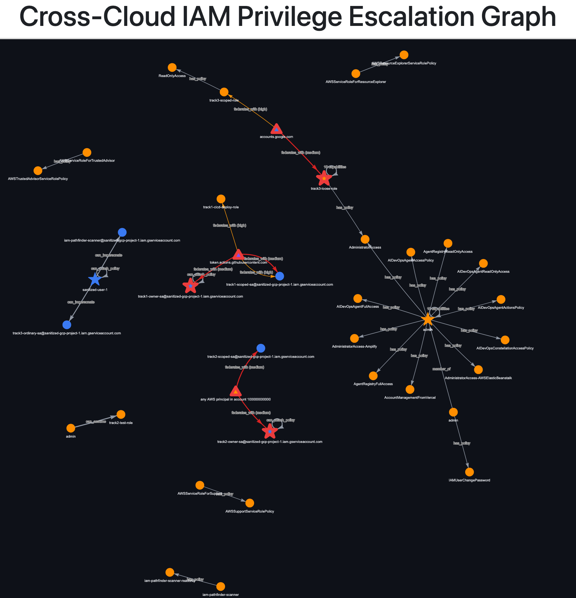
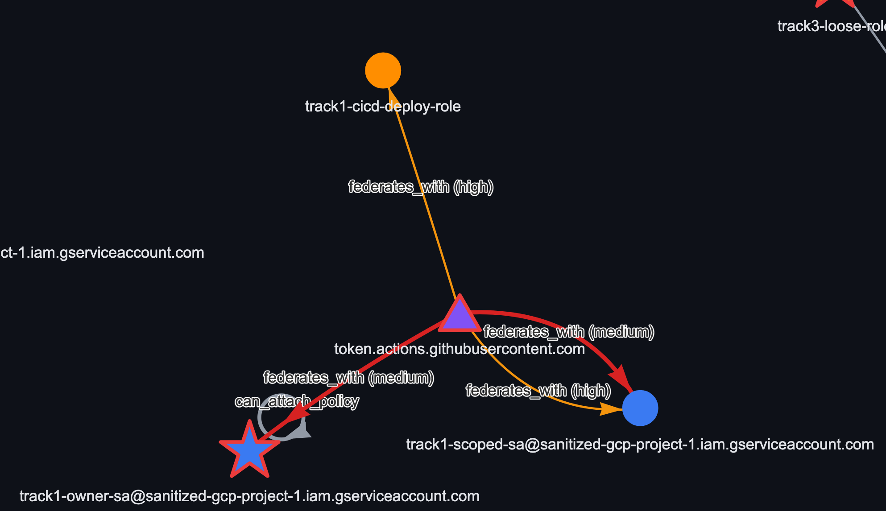
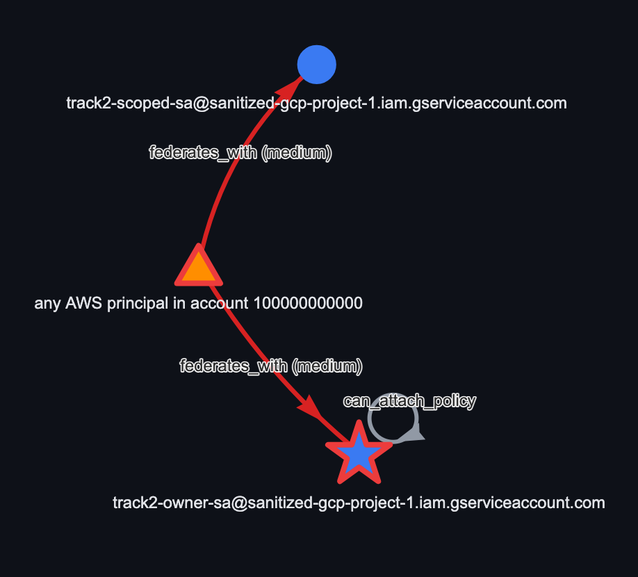
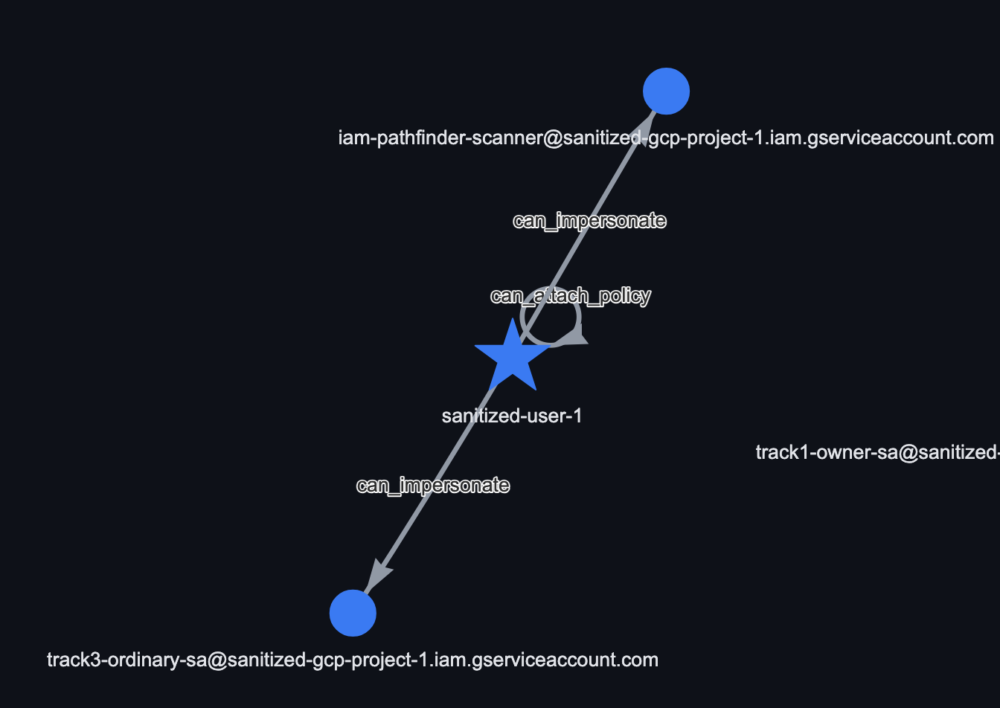

# iam-crosscloud-privesc-pathfinder

A tool that maps IAM identities across AWS and GCP into one graph and
finds privilege escalation paths that cross the boundary between them —
specifically the ones a single-cloud tool can't see, because its graph
stops at its own cloud's edge.

## Why this, not another clone

The more interesting problem is what happens when the same identity is trusted by more than one cloud. In each scenario I built, the misconfiguration itself lives entirely on one side — a GCP Workload Identity condition that only checks an AWS account, say — and a good single-cloud tool could flag that on its own. What it can't tell you is that the same identity also has a foothold in a different cloud, because its graph never includes a system it doesn't scan. That's the correlation gap: not that the misconfiguration is invisible, but that its true blast radius is. Sola Security's research frames this the same way — multi-cloud identity analysis is a cross-vendor correlation problem, where the relationships that matter span platforms that were never designed to be reasoned about together.

This project is a working answer to that gap: two collectors, each
reading only its own cloud's IAM data, feeding a correlation layer
that proves — from real API responses, not assumption — when the same
identity shows up in both.

## How it works, briefly

`AWSCollector` and `GCPCollector` each build a graph of identities,
roles, and trust relationships using nothing but their own cloud's
API. Neither knows the other exists. A correlation layer then merges
nodes that represent the same real-world identity (an OIDC issuer,
a federated principal) into one canonical node, and tags every
cross-cloud edge with a confidence score based on how tightly its
trust condition is actually scoped.

Three patterns are implemented and validated against real
infrastructure — not sample data, not a synthetic demo.

## The three scenarios

**1. A CI/CD identity trusted by both clouds, scoped correctly on one
side and not the other.** GitHub Actions federates into both AWS and
GCP. AWS's trust policy pins the exact repo and branch. GCP's
Workload Identity provider only checks the GitHub org. Any repo under
that account — not just the intended pipeline — can mint a token that
becomes GCP project owner. Validated on real AWS and GCP
infrastructure; the detector correctly flags the loose binding and
stays silent on the correctly-scoped one.

**2. GCP trusting an AWS account directly, no third party involved.**
A GCP Workload Identity provider trusts an entire AWS account with no
role-level restriction. Every IAM identity in that account, not just
the one CI role it was set up for, can become a GCP service account
owner. Proved live — a real AWS session token was exchanged for a
real GCP access token through the loose provider.

**3. AWS trusting GCP directly, the mirror direction.** Google is one
of AWS's built-in identity providers, and the trust policy here
accepted any Google-signed token audienced to `sts.amazonaws.com`
without checking which specific GCP identity sent it. An ordinary
GCP service account — nothing privileged about it on the GCP side —
becomes AWS administrator. Also proved live: a real Google identity
token, exchanged for real temporary AWS admin credentials.

## Framework mapping and Mitigation

| Scenario | MITRE ATT&CK | NIST SP 800-53 | CIS Controls | Mitigation |
| :--- | :--- | :---| :--- | :---|
|CI/CD identity trusted by both clouds | T1550.001, T1199 | AC-3 | 5.4, 6.8 | Check repository + ref, not just repository_owner |
| GCP trusts an AWS account directly | T1199, T1078.004 | AC-6 | 3.3 | Add a role-scoped attribute_condition, not just the account ID |
| AWS trusts GCP directly | T1199, T1078.004 | AC-6 | 3.3 | Add accounts.google.com:sub pinned to one GCP service account |

## Repo layout

- `src/` — collectors, correlation engine, escalation rules, pathfinder
- `terraform/track1`, `track2`, `track3` — the real infrastructure
  behind each scenario above, and `terraform/scanner` for the
  read-only identity the tool itself authenticates as
- `docs/THREAT_MODEL.md` — full technical rationale, STRIDE analysis,
  MITRE/NIST mapping
- `scripts/` — run the collectors and detector against a real sandbox,
  or explore synthetic scenarios locally with no cloud credentials at
  all
